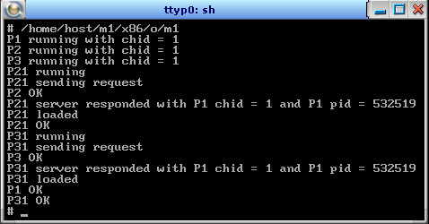
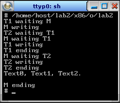
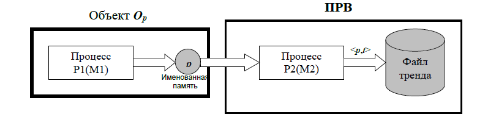
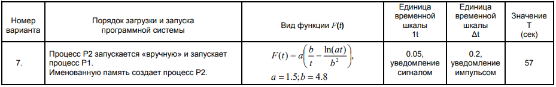
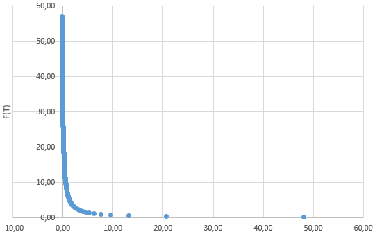

1. [Запуск и организация взаимодействия параллельных процессов](#lab1)
2. [Запуск и синхронизация нитей](#lab2)
3. [Работа с именованной памятью и службой реального времени](#lab3)
4. [Задачи по API](#lab4)

## 1. Запуск и организация взаимодействия параллельных процессов <a name="lab1"></a>

### Задание
Разработать приложение, состоящее из пяти взаимодействующих процессов. Требуется написать три программных модуля – М1, М2, М3. На базе модуля М1 из shell запускается стартовый процесс Р1(М1).

Процесс Р1 создаёт свой канал и, используя функцию семейства spawn*(), запускает процессы Р2(М2) и Р3(М2), передавая им в качестве аргумента chid своего канала, затем переходит в состояние приёма сообщений по своему каналу.

Процесс Р2 создаёт свой канал и, используя функцию семейства spawn*(), запускает процесс Р4(М3), передавая в качестве аргумента chid своего канала, затем переходит в состояние приёма сообщений по созданному каналу.

Процесс Р3 создаёт свой канал и, используя функцию семейства spawn*(), запускает процесс Р5(М3), передавая в качестве аргумента chid своего канала, затем переходит в состояние приёма сообщений по созданному каналу.

Процесс Р?(М3) устанавливает соединение c каналом родительского процесса Р?(М2) и посылает запрос на получение pid процесса Р1 и chid его канала, затем, после получения ответа (pid и chid), устанавливает соединение с каналом процесса Р1 и посылает ему сообщение «Р? loaded». После получения ответа выводит на экран «Р? ОК» и терминируется.

Процесс Р?(М2) после ответа на запрос процесса Р?(М3) выводит на терминал «Р? ОК» и терминируется.

Процесс Р1, получив сообщение от процесса Р1 или Р5, выводит его на экран и посылает ответ. После взаимодействия с Р1 и Р5 процесс Р1 выводит на экран «Р1 ОК» и терминируется.

### Порядок выполнения приложения
Стартовый процесс P1 запускается в терминале целевой системы QNX, установленной на виртуальной машине. В процессе P1 создаётся канал. Далее, из процесса P1 при помощи функции spawnl() запускаются дочерние процессы P2 и P3 без блокировки выполнения родительского процесса P1. При запуске P2 и P3, в эти дочерние процессы передаётся chid процесса P1. Процесс P1 ожидает сообщения от процессов P21 и P31, P1 входит в состояние ожидания сообщения с помощью функции MsgReceive(), получив сообщение, процесс P1 сообщает ответ о получении при помощи функции MsgReply(). После получения сообщении от P21 и P31 процесс P1 терминируется. 

Процесс P2 создаёт канал, затем создаёт дочерний процесс P21 и передает ему id созданного канала. 

Процесс P21 создаёт канал, затем устанавливает соединение с каналом родительского процесса – процесса P2 – при помощи функции ConnectAttach() и отправляет сообщение с функцией MsgSend(). Процесс P21 блокируется до тех пор пока не получит ответ о получении от процесса P2. Процесс P2 получив сообщение при помощи функции MsgReceive() от P21 отправляет ответ с значениями pid и chid процесса P1 при помощи функции MsgReply(). После получения ответа процесс P21 разблокируются, процесс P2 выводит сообщение в консоль «P2 OK» и терминируется. 

После, процесс P21 устанавливает соединение с каналом процесса P1 и отправляет сообщение «P21 loaded». После получения ответа от процесса P1, процесс P21 выводит сообщение «P21 OK» и терминируется.

Порядок выполнения процесса P3 аналогичен процессу P2 (процесс P3 создаёт свой дочерний процесс P31 и т.д.).

Процесс P1, получив сообщение от процессов P21 и P31, отправляет ответное сообщение. Затем выводит в терминал «P1 OK» и терминируется. 

Процессу P1 соответствует модуль M1, процессам P2 и P3 – модуль M2, процессам P21 и P31 – модуль M3.



## 2. Запуск и синхронизация нитей <a name="lab2"></a>

### Задание
Цель работы: освоение функций запуска и синхронизации нитей при разработке многонитьевых приложений в ОСРВ QNX.

Разработать приложение, состоящее из одного процесса с тремя запущенными нитями: М(main), Т1(F1), Т2(F2).

В качестве нити М(main) выступает функция main(). Нити Т1(F1) и Т2(F2) запускаются нитью М(main) на базе соответственно функций F1() и F2(). Все три нити, работая параллельно, должны совместно динамически сформировать текст вида: "Text0, Text1, Text2.\n".

При разработке приложения необходимо обязательно применить следующие методы синхронизации: неименованные семафоры, условные переменные, присоединение. Все методы синхронизации нужно применить даже если их применение будет выглядеть несколько искусственным.

### Порядок выполнения приложения
Вначале нить М(main) запускает первой нить Т1(F1), затем – Т2(F2), передавая им в качестве параметра указатель совместно формируемого текста.

Далее нить М(main), записывая в текст букву за буквой, формирует свою часть текста: "Text0, ".

После формирования нитями всего текста нить М(main) выдаёт его на печать и завершает свою работу.

Запущенная нить Т1(F1) должна тем же способом добавить в формируемый текст свою часть: "Text1, ". 

После завершения записи соей части текста нитью Т1(F1), нить T2(F2) ожидает записи в буфер своей части текста "Text2.\n ", после чего завершает свою работу.

Порядок хода нити M и T1 согласован с помощью семафора. Порядок хода T1 и T2 согласован условной переменной: нить T2 не вводит символы в строку, пока T1 не введёт свои символы. Нить M ожидает, когда значение семафора достигнет единицы: после ввода символов T1 увеличивает значение семафора. Нить M присоединена к нити T2.

Для имитации времени записи в текст одной буквы использовался пустой цикл в 1000 итераций.



## 3. Работа с именованной памятью и службой реального времени <a name="lab3"></a>

### Задание и порядок выполнения приложения



Разработать приложение реального времени (ПРВ), осуществляющее мониторинг состояния абстрактного физического объекта Op, p – изменяющийся во времени параметр объекта. Мониторинг объекта Op осуществляется на относительном интервале времени t∈[0,Т]. За 0 принимается момент начала штатной работы ПРВ после её загрузки в вычислительную среду. В процессе мониторинга ПРВ формирует на вшенем носителе файл тренда параметра p. Непосредственно в момент времени Т программная система должна завершить свою работу. 

Изменение параметра p во времени моделируется функцией p=F(t), где t∈[0,Т] – момент времени получения текущего значения параметра p, выраженный в секундах. 

Объект Op в программной системе моделируется процессом Р1(М1). Программный модуль М1 реализует вычисление функции p=F(t) и размещение полученного текущего значения параметра p в именованную память, предварительно созданную при загрузке ПРВ. Именованная память создаётся процессом P2.

ПРВ, осуществляющее мониторинг, реализуется в программной системе в виде процесса Р2(М2), запускаемого на базе модуля М2 (сначала запускается P2, P2 же запускает P1): 

Процесс Р1, начиная с t=0, периодически с заданной частотой обновляет текущее значение параметра p в именованной памяти. 

Процесс Р2, начиная с момента времени t=0, периодически с заданным периодом Δt считывает из именованной памяти текущее значение параметра p и формирует датированное значение в виде пары – <p, t>. Результаты периодического считывания значений параметра p и соответствующей метки времени t используются процессом Р2 для занесения в текстовый файл (тренд параметра p) символьной строки, в которой символьное представление значения параметра p и соответствующего момента времени t разделяются знаком табуляции \t формата, а вся строка завершается управляющим символом \n: "<p>\t<t>\n>"

Процессы Р1 и Р2 должны быть синхронизированы по моменту времени t=0. (процесс Р2 должен получить первое значение параметра p в момент t=0). Процесс P2 не начинает считывание значений, пока P1 не пошлёт сигнал о разрешении считывания: P1 ожидает сигнал SIGUSR1, при получении сигнала процесс вызывает процедуру, которая установит флаги на разрешение начала считывания значений из именованной памяти (если были посланы сообщения READY_TO_START_TIMER и READY_TO_START_READ) – пока флаги не подняты P2 не считывает значения из именованной памяти. 

При наступлении момента t=Т работа программной системы должна немедленно завершиться (все процессы терминируются). 

Результаты работы ПРВ представить в виде графика тренда параметра p(t), например, загрузив содержимое полученного файла с трендом в MS EXCEL.



На рисунке представлен график тренда параметра p. Значения графика были получены в результате выполнения, разработанного приложения. График построен при помощи программы Microsoft Office Excel 2019.

На оси Х расположены значения времени T. На оси Y расположены значения функции от пройденного времени F(T).



## 4. Задачи по API <a name="lab4"></a>

### 135. Компоновка на этапе выполнения

Разработать программу, обеспечивающую загрузку динамической библиотеки в режиме исполнения. При запуске, программе передаётся имя динамической библиотеки, имя функции, которая должна быть вызвана, и её аргумент. Функция в библиотеке принимает на вход int и возвращает int. Результат, возвращаемый функцией должен быть выведен отдельной строкой (оканчиваться символом новой строки \n)  в stdout.

Пример вызова
```./solution libShared.so someSecretFunctionPrototype 8 16```

В примере, должна быть загружена библиотека libShared.so, в которой вызвана функция someSecretFunctionPrototype с аргументом 8. Результат (16) выведен в stdout.

### 352. Поиск ppid c использованием procfs

Разработать программу solution, которая осуществляет поиск родительского PID текущего процесса в файловой системе proc и выводит найденное значение на консоль.  Результат, возвращаемый функций должен быть выведен отдельной строкой(должен оканчиваться символом перевода строки \n) в stdio.

Пример вызова
```
./solution
13221
```

### 353. Поиск ppid c использованием procfs

Разработать программу solution, которая осуществляет поиск и подсчет числа процессов с именем genenv в системе Linux на которой выполняется программа. 

Пример вызова
```
./solution
13
```

### 354. Поиск пути к init по заданному pid 

Разработать программу solution, которая по заданному pid, осуществляет поиск пути в дереве процессов до процесса с идентификатором 1 (init). Для каждого найденного процесса печатается в отдельной строке его идентификатор.

Пример вызова
```
./solution 1766
1766
1299
465
1
```

### 461. Чтение консольного вывода
Некоторая утилита генерирует довольно большой вывод, а вам требуется всего-лишь посчитать количество символов '0' в этом выводе. Утилита при запуске принимает 1 параметр. Вам требуется разработать программу, которая вызывает указанную утилиту, с заданным параметром и подсчитывает количество символов '0' в ее выводе. Ваша программа принимает на вход 2 параметра -- имя утилиты, в текущем каталоге и ее параметр. Ваша программа должна после подсчета вывести найденное число '0' в отдельной строке, заканчивающейся символом конца строки.

```
Пример вызова
./solution someprog param
234222
```

### 463. Подсчёт сигналов

Разработать приложение, умеющее обрабатывать сигналы SIGUSR1, SIGUSR2, SIGTERM. После старта Ваше приложение должно по приходу одного из сигналов SIGUSR1, SIGUSR2 выполнять суммирование числа срабатываний каждого из сигналов, а после прихода сигнала SIGTERM, требуется вывести в стандартный поток вывода 2 числа, разделенных пробелом, соответствующих количеству обработанных сигналов SIGUSR1, SIGUSR2, и завершить программу. Вывод оканчивается символом конца строки.

```
Пример вызова
./solution 
79 38
```

### 464. "Правильный" демон 

Снабдить демон обработчиком сигнала SIGURG, по приходу которого демон должен завершать свою работу.

```
Пример вызова
./solution
13336
```

### 465. Разделяемая память

В системе существуют 2 региона разделяемой памяти, заполненной некоторыми числами (типа int). Каждый из регионов имеет размер 1000 байт. Вам требуется разработать приложение, которое попарно суммирует первые 100 чисел в этих регионах и помещает суммы в новый (созданный вашим приложением) регион памяти размером 1000 байт. Таким образом, после завершения работы Вашего приложения в памяти должен существовать регион разделяемой памяти размером 1000 байт, содержащий в начале 100 сумм. Перед завершением работы приложение выводит в стандартный поток ввода-вывода ключ созданного региона, завершающийся символом конца строки. На вход ваше приложение принимает ключи существующих регионов памяти.

```
Пример вызова
./solution 456764 456768
512997```

### 571. Host Resolver

Разработайте утилиту командной строки, принимающую на вход имя хоста и печатающую в стандартный поток вывода список IP-адресов, ассоциированных с данным именем.

```
Пример вызова
./solution yandex.ru
213.180.204.3
93.158.134.3
213.180.193.3
```

### 572. UDP Log Service

Разработайте UDP сервер для логирования (сбора и записи) сообщений. Сервер при запуске принимает параметр -- номер порта, на котором будут приниматься запросы. Каждый запрос приходящий к серверу - строка, не превышающая размер 5K.  Задача сервера -- выводить приходящие строки в стандартный поток ввода-вывода, завершающиеся символом конца строки.

Сервер завершает работу, когда получает строку содержащую только текст 'OFF', и заканчивающуюся символом перевода строки '\n'. 

Сервер использует локальный адрес 127.0.0.1

Пример вызова
```
./solution 22476
foo
bar 
foo bar baz
```

### 573. TCP String Sorter

Разработайте TCP сервер, предназначенный для сортировки символов в строке. Сервер получает на вход строки, оканчивающиеся символом '\0', сортирует в них символы в порядке убывания ASCII-кодов и отсылает обратно на клиент, в виде строки заканчивающейся '\0'. Завершение работы сервера происходит после получения строки, содержащей только 'OFF'. 

При старте сервер получает на вход номер порта в качестве параметра командной строки. bind производится на адресе 127.0.0.1

Пример вызова
```
./solution 13555
```


